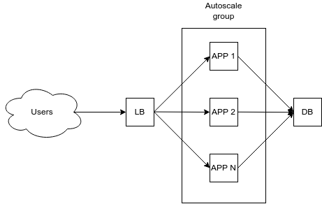

# FACEIT DevOps Challenge
Before we run the terraform apply command, we need to add variables, because these variables contain critical information
```
export TF_VAR_application='{ "image" = "faceit:stable", "postgresql_port" = "5432", "postgresql_user" = "postgres", "postgresql_password" = "mysecretpassword", "postgresql_dbname" = "postgres" }'
```

## How it work
### 1st case Terraform


First I wrote a [Dockerfile](../test-app/Dockerfile) to run our application. We can tag our container as faceit:stable, later we will need it when scaling. Next, I created an autoscale group that will scale our application depending on the load. When the load is small, the minimum number of instances is enough for us, when the load increases, the scaling of the application / instance begins, and here we need a health check so that loadbalances understands that the application is ready to receive traffic. A new instance will be created with a container with the tag faceit:stable, which means that the instance is pulled from the dockerhab with the necessary image. After lowering the load, the number of instances will return to the minimum value specified in the terraform code.

When we need to upgrade to a new version, we just need to update the docker image and restart the application.
We can increase the number of instances, and they will automatically have the faceit:stable version. And also we can simply delete the old instances and, if necessary, the autoscale group will restore the minimum number of instances already with the necessary version of the image, and health checks will allow the load balancer to allow traffic only to live instances.

### 2nd case k8s

If our team is ready to use K8S, we have the opportunity to use its auto scaling and updating features. I wrote 2 small yaml files as an example. How it will work, when the limits on memory or CPU are exceeded, pod's will start scaling. It is also easier for us to perform updates using, for example, Rolling Update, and livenessprobe, readinessprobe to control incoming traffic.


### CI/CD

- Push code to the repository
- Run pipeline for testing code, security test, etc.
- If all check passed, merge code and run build docker image.
- Deploy new image to dev, test environment
- After success deploy to dev/test, we can deploy to production
- Used RollingUpdate in k8s, or autoscale and delete old instance, to update without any downtime
